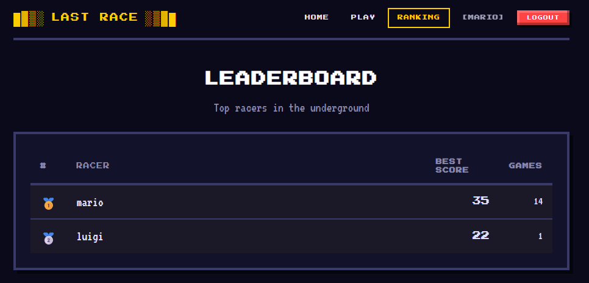
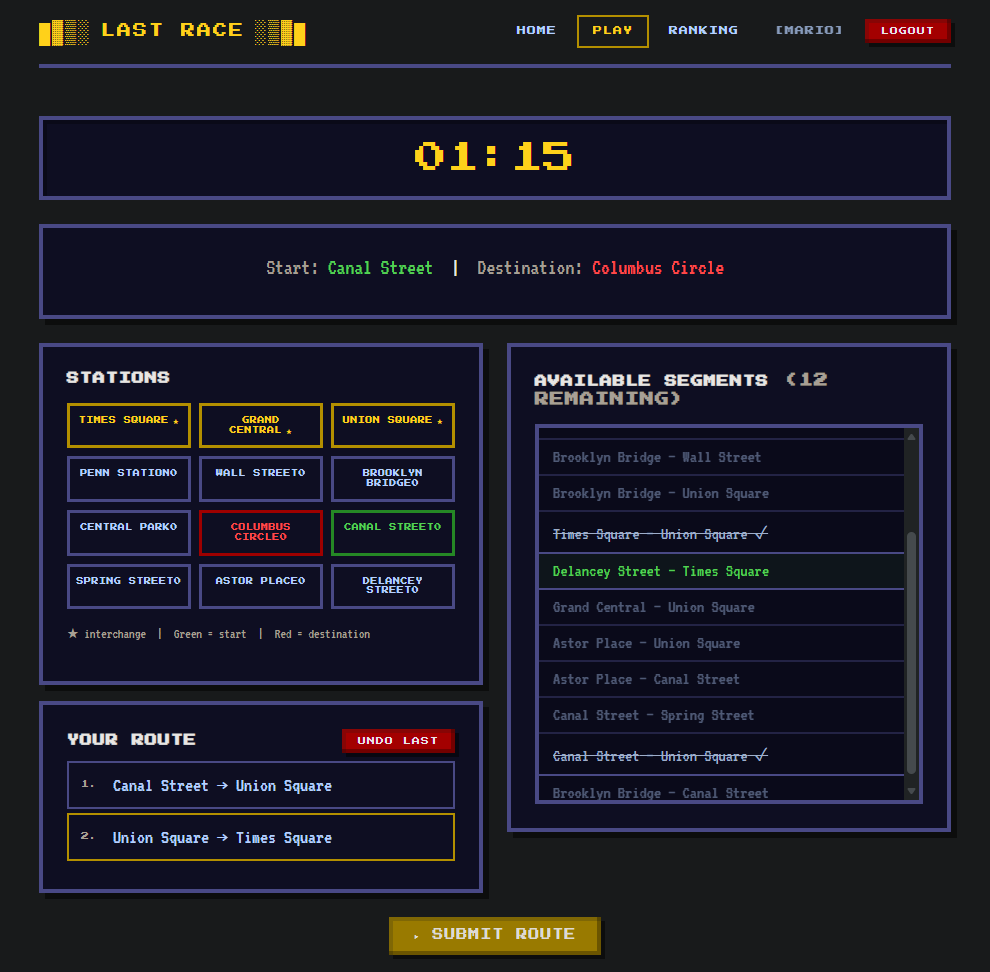

# Exam #1: "Last Race"
## Student: s364163 ALTUNTAS ALI EREN

## React Client Application Routes

- Route `/`: Home page with game instructions and rules. Anonymous visitors see only textual instructions; logged-in users see a "Play Now!" button. No network map is shown on this page.
- Route `/login`: Login form (username + password). Uses Passport.js local strategy. Already-logged-in users are redirected to `/play`. Demo credentials are displayed on the page for exam evaluation.
- Route `/play`: **Protected.** The main game arena. Renders the full game lifecycle: Setup (network map), Planning (90-second timer + route builder), Execution (step-by-step event reveal), and Result (final score + Play Again).
- Route `/ranking`: **Protected.** Displays the general leaderboard showing all users who have played at least one game, ordered by their best score descending.

## API Server

All game endpoints require an authenticated session (except session endpoints themselves). Responses are JSON. CORS is configured for `http://localhost:5173` with credentials enabled.

- **POST `/api/sessions`**
  - Request body: `{ username, password }`
  - Response: `{ id, username, best_score, games_played }` on success, or `{ error }` on failure (401).
  - Creates a session cookie (`connect.sid`) on successful authentication.

- **DELETE `/api/sessions/current`**
  - No request body.
  - Response: `{ message }` confirmation.
  - Destroys the server session and clears the session cookie.

- **GET `/api/sessions/current`**
  - No request body.
  - Response: `{ id, username, best_score, games_played }` if logged in, or `{ error: "Not authenticated" }` (401).
  - Used by the frontend on initial load to check if a session cookie exists.

- **GET `/api/network`** _(auth required)_
  - No parameters.
  - Response: `{ stations: [...], lines: [...], connections: [...] }` with full network topology including station names, interchange flags, line names, line colors, and ordered station sequences.

- **GET `/api/ranking`** _(auth required)_
  - No parameters.
  - Response: `{ ranking: [{ username, best_score, games_played }, ...] }` — top 10 users who have played at least one game, ordered by best_score descending.

- **GET `/api/game/start`** _(auth required)_
  - No parameters.
  - Response: `{ start, destination, segments: [{ stationA, stationB }, ...] }`.
  - Randomly selects a starting station and a destination station reachable with a minimum distance of 3 segments. Returns the scrambled list of all connected station pairs WITHOUT line affiliations (player must mentally reconstruct the network).

- **POST `/api/game/submit`** _(auth required)_
  - Request body: `{ start, destination, route: [{ from, to }, ...] }`
  - Response (valid): `{ valid: true, finalScore, events: [{ segment, eventDescription, coinEffect, coinsAfter }, ...] }`
  - Response (invalid): `{ valid: false, finalScore: 0, message }`
  - Validates the route against four constraints: endpoints match, contiguity, no repeated segments, line changes only at interchange stations. If valid, applies random events segment by segment and records the game in the database, updating the user's best_score.

## Database Tables

- Table `users` — Registered player accounts. Stores username, bcrypt-hashed password, best_score (highest game score), and games_played (total games count).
- Table `stations` — Underground network stations. Each has a unique name and an is_interchange flag (1 if served by more than one line).
- Table `lines` — Metro lines. Each has a unique name and a hex color for display on the network map.
- Table `line_connections` — Maps stations to lines in sequential order. Each row is one stop on a line. The sequence_order defines the linear position (0 = first stop).
- Table `events` — Retro-themed random events. Each has a description (displayed during execution) and a coin_effect integer (-4 to +4).
- Table `games` — Completed game records. Links a user_id to a score and a played_at timestamp.

## Main React Components

- `AuthContext` (in `context/AuthContext.jsx`): Provides global authentication state (user, login, logout) via React Context. Handles initial session check on app load.
- `Navbar` (in `components/Navbar.jsx`): Top navigation bar with conditional links — anonymous users see Home + Login; logged-in users see Home + Play + Ranking + username + Logout.
- `Game` (in `components/Game.jsx`): Core game component managing four phases — Setup (network map display), Planning (90-second timer, segment-based route builder with undo, auto-submit on expiry), Execution (step-by-step event reveal with animated timer), and Result (final score, Play Again loop).
- `Home` (in `pages/Home.jsx`): Instructions page with game rules. Content varies based on authentication state (no map for anonymous users).
- `Login` (in `pages/Login.jsx`): Username/password form connected to the Passport.js backend. Redirects to /play on success.
- `Ranking` (in `pages/Ranking.jsx`): Leaderboard table fetching from GET /api/ranking. Handles loading, empty (no games played), and error states.

## Screenshots
Ranking Page

During a Game

## Users Credentials

| Username | Password      |
|----------|---------------|
| mario    | password123   |
| luigi    | password123   |
| toad     | password123   |

## Use of AI Tools

Google Gemini was used for:
  - The frontend design and theme
  - Choosing and implementing the game algorithm
  - Pre-populating the initial database, and SQL queries inside the code.
  - Preparing the README.md
  - Overall complementary help ensuring the path the developer is on is right.